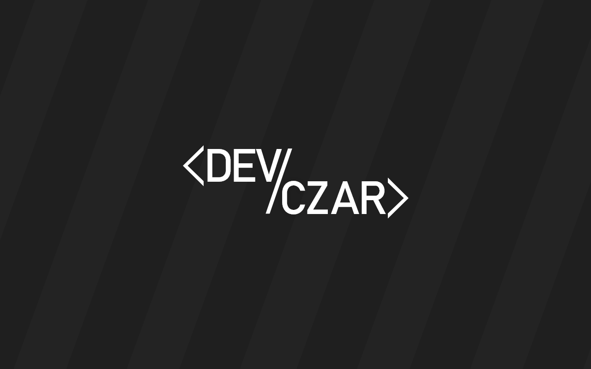

<h1 align="center">Hi :wave: , I'm Lukas Briza</h1>

I´m frontend developer with passion to write clean and understandable code.
  Mostly I like to work on projects which are closest to my areas of interest:

<ul>
  <li> Cryptocurrency</li>
  <li>:money_with_wings: Finance</li>
  <li>:tv: Movies</li>
  <li>:runner: Sports</li>
  <li>:video_game: Games</li>
</ul>

Coding and web development is my passion. I love to look for ways and innovations which help me to improve my code.
  If you´re searching for some colleagues to your projects, dont´t hesitate to contact me.

<h3 align="left">Connect with me:</h3>
<ul>
  <li>:email: lukasbriza@seznam.cz</li>
  <li><a href="https://stackoverflow.com/users/lukasbriza" target="blank"> lukasbriza </a></li>
</ul>

<h3 align="left">Languages and Tools:</h3>

              

